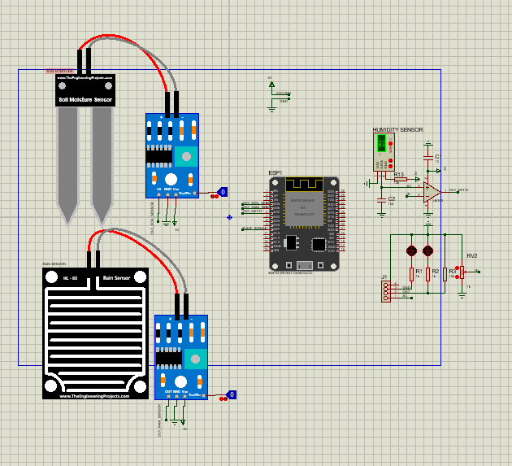

# 🌱 AI-IoT Smart Irrigation System


> **A smart gardening system that automates watering processes by analyzing real-time environmental data with 98% AI accuracy.**


## 📖 Overview
This project addresses the inefficiency of manual plant watering by introducing an automated, intelligent solution. We designed a comprehensive **IoT system** that continuously monitors soil moisture, temperature, humidity, and rain status. The core of the system is a **Random Forest** machine learning model that processes sensor data to make real-time watering decisions, ensuring optimal plant health while conserving water resources.

## 🚀 Key Features
- **Real-time Monitoring:** Tracks Temperature, Humidity (DHT22), Soil Moisture, and Rain status via ESP32 sensors.
- **AI-Driven Automation:** Utilizes a **Random Forest Classifier** trained on environmental datasets to predict "Water" or "Don't Water" with **98% accuracy**.
- **Interactive Dashboard:** A full-stack web application (ReactJS + Node.js) allows users to view live sensor data and manually control the pump.
- **Low Latency:** Uses **WebSocket** for instant communication between the hardware, server, and web client (< 500ms latency).
- **Cost-Effective Design:** Complete hardware prototype built for approximately **600,000 VND**.

## 🛠️ Tech Stack

### Software
| Component | Technology |
|-----------|------------|
| **Frontend** | ReactJS, Tailwind CSS, Vite |
| **Backend** | Node.js, Express, Socket.io |
| **AI Model** | Python, Scikit-learn (Random Forest), Pandas |
| **Database** | (Local storage / JSON) |

### Hardware
- **Microcontroller:** ESP32-NodeMCU-32S
- **Sensors:**
  - Soil Moisture Sensor
  - Rain Water Sensor
  - DHT22 (Temperature & Humidity)
- **Actuators:**
  - Water Pump R385 (12V)
  - MOSFET F5305S / Relay Module
- **Power:** 12V-2A Power Adapter

## 🏗️ System Architecture
The system operates on a closed-loop control mechanism:
1.  **Sensors** collect data and send it to the **ESP32**.
2.  **ESP32** transmits data to the **Node.js Server** via WebSocket.
3.  The **AI Engine** (or rule-based logic) analyzes data to decide action.
4.  **Server** sends commands back to ESP32 to trigger the **Pump**.
5.  **User** visualizes data and overrides control via the **React Dashboard**.


*Figure 1: Hardware Circuit Schematic*

## 💻 Installation & Setup

### Prerequisites
- Node.js (v14+) & npm
- Python (v3.8+)
- Arduino IDE (for ESP32 firmware)

### 1. Hardware Setup
Wire the components according to the schematic:
- **DHT22 Data:** GPIO 14
- **Soil Moisture:** GPIO 34 (Analog)
- **Rain Sensor:** GPIO 35 (Analog)
- **Pump/Relay:** GPIO 26

### 2. Backend Setup
Start the server to handle WebSocket connections and API requests.
```bash
cd DATKLL/DA_TKLL-dev/backend
npm install
node server.js
```
### 3. Frontend Setup
Launch the web dashboard to visualize data.
```bash
cd DATKLL/DA_TKLL-dev/frontend
npm install
npm run dev
```

### 4. AI Model Training (Optional)
If you wish to retrain the model with new data (`dataset.csv`):
```bash
cd DATKLL/training
pip install -r requirement.txt
python training.py
```
## 📊 Performance Analysis
The Random Forest model was evaluated using a dataset of environmental conditions and watering requirements.

| Metric | Score |
| :--- | :--- |
| **Accuracy** | **98%** |
| Precision | 97.5% |
| Recall | 98.2% |
| F1-Score | 97.8% |

